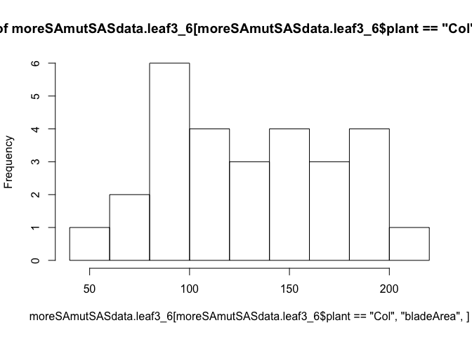

# SA ET mutants SAS phenotyping (adult)
Kazu Nozue  
May 29, 2017  
#  060716 cleaning up scripts for SA project (paper) 
* 

```r
if(Sys.info()["user"]=="nozue") {
  homedir<-"/Volumes/data_work/Data8/NGS_related/Arabidopsis_analysis/Nozue2016_SAStranscriptome_finalfinal_newVST/Nozue2016_SAStranscriptome_scripts/SA_SASproject_scripts/"
}
# if(Sys.info()["user"]=="nozue") {
# homedir<-"/Volumes/Toshiba_CANVIO2/not synched with my computer-selected/Nozue2016_SAStranscriptome_scripts/SA_SASproject_scripts"
#} # customize homedir
setwd(homedir)
# reading necessary funcitons and libraries
source("function.R")
```

```
## Loading required package: Matrix
```

```
## 
## Attaching package: 'lmerTest'
```

```
## The following object is masked from 'package:lme4':
## 
##     lmer
```

```
## The following object is masked from 'package:stats':
## 
##     step
```

```r
#################################################
# more SA mutant (eg. npr2/3/4) (Jan 26, 2017)
# checking setH (May 29, 2017)
#################################################
moreSAmutSASdata<-read.csv("../../Nozue2016_SAStranscriptome_data/input/moreSAmut_SAS_leaf.csv")
head(moreSAmutSASdata)
```

```
##                          Image_file set treatment plant rep leaf
## 1 2016moreSASmut_exp3001.tif (blue)   C       sun  sid2   1    2
## 2 2016moreSASmut_exp3001.tif (blue)   C       sun  sid2   1    3
## 3 2016moreSASmut_exp3001.tif (blue)   C       sun  sid2   1    4
## 4 2016moreSASmut_exp3001.tif (blue)   C       sun  sid2   1    5
## 5 2016moreSASmut_exp3001.tif (blue)   C       sun  sid2   1    6
## 6 2016moreSASmut_exp3001.tif (blue)   C       sun  sid2   1    7
##   petioleLength bladeLength bladeWidth bladeArea bladePerimeter
## 1         5.055       8.015      7.226    45.489         33.189
## 2         7.110      11.563      9.188    83.441         44.365
## 3         6.760      11.345      9.904    88.253         49.022
## 4         8.449      15.233     10.990   131.489         57.404
## 5         7.981      14.790      9.892   114.903         54.102
## 6         6.696      16.358      9.703   124.661         57.489
##   bladeCircularity X X.1
## 1            0.519      
## 2            0.533      
## 3            0.461      
## 4            0.501      
## 5            0.493      
## 6            0.474
```

```r
# ftable
moreSAmutSASdata.ftable<-ftable(moreSAmutSASdata[,c("petioleLength","treatment","set","plant")],col.vars=c("set"),row.vars=c("plant","treatment"))
moreSAmutSASdata.ftable
```

```
##                    set  A  B  C  D  E  F  G  H
## plant    treatment                            
## Col      shade         51 39 41 21 51 42 19 26
##          sun           39 35 53 39 37 28 18 29
## NahG     shade          0  0 19  7 28 30 34 15
##          sun            0  0  9 18 17 25 40 21
## npr1     shade          0  0 18  7 16 33 10  0
##          sun            0  0 19 37 26 17 17 12
## npr2/3/4 shade          0  0 95 75 42 56 29 18
##          sun           10  0 96 69 31 17 31 23
## npr3     shade         47 49  9  9 41 39 40 35
##          sun           44 61 20 18 40 27 39 31
## npr3/4   shade         27 33 21  0 10 30 36 35
##          sun           39 32 10  0  0 38 41 32
## npr4     shade         46 41 11 19 41 35 31 28
##          sun           41 45 22  0 40 30 32 32
## sid1     shade          0  0 10 14 39 31 41 37
##          sun            0  0 10  7 18 30 38 15
## sid2     shade         30 44 10 18 39 31 29 26
##          sun           47 43 17  8 42  0 42 14
```

```r
# select only set H (new light condition since Feb 2017; light condition accident on May 9)
moreSAmutSASdata<-moreSAmutSASdata[moreSAmutSASdata$set=="H",]

moreSAmutSASdata$set<-as.factor(as.character(moreSAmutSASdata$set))
moreSAmutSASdata.ftable<-ftable(moreSAmutSASdata[,c("petioleLength","treatment","set","plant")],col.vars=c("set"),row.vars=c("plant","treatment"))
moreSAmutSASdata.ftable# 
```

```
##                    set  H
## plant    treatment       
## Col      shade         26
##          sun           29
## NahG     shade         15
##          sun           21
## npr1     shade          0
##          sun           12
## npr2/3/4 shade         18
##          sun           23
## npr3     shade         35
##          sun           31
## npr3/4   shade         35
##          sun           32
## npr4     shade         28
##          sun           32
## sid1     shade         37
##          sun           15
## sid2     shade         26
##          sun           14
```

```r
# PBL
moreSAmutSASdata$petiole_bladeLength<-with(moreSAmutSASdata,petioleLength/bladeLength)
# rename rep
moreSAmutSASdata$rep2<-with(moreSAmutSASdata,paste(set,rep,sep="_"))
moreSAmutSASdata$treatment<-relevel(moreSAmutSASdata$treatment,ref="sun")
# only leaf3-6
moreSAmutSASdata.leaf3_6<-moreSAmutSASdata[moreSAmutSASdata$leaf>2&moreSAmutSASdata$leaf<7,]
# check strange data
moreSAmutSASdata.leaf3_6[moreSAmutSASdata.leaf3_6$petiole_bladeLength<0.3,]
```

```
##                             Image_file set treatment    plant rep leaf
## 3392 2016moreSASmut_exp8001.tif (blue)   H       sun      Col   4    6
## 3444 2016moreSASmut_exp8004.tif (blue)   H       sun     npr3   1    6
## 3527 2016moreSASmut_exp8007.tif (blue)   H       sun     npr1   1    5
## 3528 2016moreSASmut_exp8007.tif (blue)   H       sun     npr1   1    6
## 3534 2016moreSASmut_exp8007.tif (blue)   H       sun     npr1   2    6
## 3537 2016moreSASmut_exp8007.tif (blue)   H       sun npr2/3/4   1    3
## 3540 2016moreSASmut_exp8007.tif (blue)   H       sun npr2/3/4   1    6
##      petioleLength bladeLength bladeWidth bladeArea bladePerimeter
## 3392         1.778       9.545      6.070    45.507         33.782
## 3444         3.506      13.066      9.803   100.597         50.377
## 3527         1.291       6.830      4.585    24.591         26.416
## 3528         0.653       6.584      4.345    22.464         27.178
## 3534         1.494       7.944      5.468    34.115         29.633
## 3537         2.600      11.061      7.739    67.227         40.471
## 3540         2.974       9.916      6.210    48.358         36.068
##      bladeCircularity X X.1 petiole_bladeLength rep2
## 3392            0.501                0.18627554  H_4
## 3444            0.498                0.26833002  H_1
## 3527            0.443                0.18901903  H_1
## 3528            0.382                0.09917983  H_1
## 3534            0.488                0.18806647  H_2
## 3537            0.516                0.23506012  H_1
## 3540            0.467                0.29991932  H_1
```

```r
moreSAmutSASdata.leaf3_6[moreSAmutSASdata.leaf3_6$petiole_bladeLength>1,]
```

```
##  [1] Image_file          set                 treatment          
##  [4] plant               rep                 leaf               
##  [7] petioleLength       bladeLength         bladeWidth         
## [10] bladeArea           bladePerimeter      bladeCircularity   
## [13] X                   X.1                 petiole_bladeLength
## [16] rep2               
## <0 rows> (or 0-length row.names)
```

```r
# remove too small Col in setE, shade, rep1
moreSAmutSASdata.leaf3_6[moreSAmutSASdata.leaf3_6$plant=="Col"&moreSAmutSASdata.leaf3_6$treatment=="shade"&moreSAmutSASdata.leaf3_6$set=="E"&moreSAmutSASdata.leaf3_6$rep==1,]
```

```
##  [1] Image_file          set                 treatment          
##  [4] plant               rep                 leaf               
##  [7] petioleLength       bladeLength         bladeWidth         
## [10] bladeArea           bladePerimeter      bladeCircularity   
## [13] X                   X.1                 petiole_bladeLength
## [16] rep2               
## <0 rows> (or 0-length row.names)
```

```r
hist(moreSAmutSASdata.leaf3_6[moreSAmutSASdata.leaf3_6$plant=="Col","bladeArea",]
)
```

<!-- -->

```r
#
moreSAmutSASdata.leaf3_6<-moreSAmutSASdata.leaf3_6[!(moreSAmutSASdata.leaf3_6$plant=="Col"&moreSAmutSASdata.leaf3_6$treatment=="shade"&moreSAmutSASdata.leaf3_6$set=="E"&moreSAmutSASdata.leaf3_6$rep==1),]

# # only leaf3 to leaf6. find strange data
moreSAmutSASdataleaf3_6.rawdataplot.PL<-ggplot(moreSAmutSASdata.leaf3_6, aes(x=treatment,y=petioleLength,color=treatment)) + geom_jitter() + facet_grid(plant~leaf)
moreSAmutSASdata.leaf3_6.rawdataplot.PBL<-ggplot(moreSAmutSASdata.leaf3_6, aes(x=treatment,y=petiole_bladeLength,color=treatment)) + geom_jitter() + facet_grid(plant~leaf)
# 
# ggsave(moreSAmutSASdata.setE.leaf3_6.rawdataplot.PL, file="moreSAmutSASdata.setE.leaf3_6.rawdataplot.PL.pdf")
# 
###
# moreSAmutSASdata.setE.leaf3_6[moreSAmutSASdata.setE.leaf3_6$petioleLength<1,] #none
### reference is "sun"
# PL
moreSAmutSASdata.leaf3_6$plant<-relevel(moreSAmutSASdata.leaf3_6$plant,ref="Col")
moreSAmutSASdata.leaf3_6$treatment<-relevel(moreSAmutSASdata.leaf3_6$treatment,ref="sun")
moreSAmutSASdata.leaf3_6<-moreSAmutSASdata.leaf3_6[!moreSAmutSASdata.leaf3_6$plant=="npr1",]
moreSAmutSASdata.leaf3_6$plant<-as.factor(as.character(moreSAmutSASdata.leaf3_6$plant))
#summary.table.PL.rCol.rSun.leaf3_6.moreSAmutSASdata<-model2e.lmer("PL",moreSAmutSASdata.leaf3_6,"Col","sun",lmer(petioleLength~plant*treatment  + (1 | leaf) + (treatment | set) + (1|rep2),data=moreSAmutSASdata.leaf3_6),saveplot=T) # use this if there are more sets
summary.table.PL.rCol.rSun.leaf3_6.moreSAmutSASdata<-model2e.lmer("PL",moreSAmutSASdata.leaf3_6,"Col","sun",lmer(petioleLength~plant*treatment  + (1 | leaf)  + (1|rep2),data=moreSAmutSASdata.leaf3_6),saveplot=T) 
```

```
## [1] "phenotype is PL."
## [1] "reference (accession) is Col."
## [1] "reference (treatment) is sun."
##                                Estimate Std. Error        df    t value
## plantCol                      7.6254375  0.5224965  30.24602 14.5942353
## plantNahG                    -0.1968206  0.6607788 181.93582 -0.2978616
## plantnpr2/3/4                -1.4869040  0.6607788 181.93582 -2.2502296
## plantnpr3                    -0.1107500  0.6078027 180.19985 -0.1822137
## plantnpr3/4                  -0.1912500  0.6078027 180.19985 -0.3146580
## plantnpr4                     0.2638125  0.6078027 180.19985  0.4340430
## plantsid1                    -0.2519065  0.7882618 182.53221 -0.3195722
## plantsid2                    -0.3924985  0.7533550 182.49869 -0.5210007
## plantCol:treatmentshade       2.5326794  0.6607788 181.93582  3.8328703
## plantNahG:treatmentshade     -3.2832322  1.0295849 181.64883 -3.1888892
## plantnpr2/3/4:treatmentshade -0.5241489  1.0295849 181.64883 -0.5090876
## plantnpr3:treatmentshade      0.7539456  0.8978044 181.24052  0.8397661
## plantnpr3/4:treatmentshade    0.3407611  0.9052216 181.38847  0.3764395
## plantnpr4:treatmentshade      0.1622708  0.9284339 180.19985  0.1747791
## plantsid1:treatmentshade     -0.3987103  1.0340583 182.93927 -0.3855782
## plantsid2:treatmentshade     -1.1604182  1.0296161 181.66068 -1.1270397
##                                  Pr(>|t|)
## plantCol                     3.108624e-15
## plantNahG                    7.661486e-01
## plantnpr2/3/4                2.563196e-02
## plantnpr3                    8.556198e-01
## plantnpr3/4                  7.533853e-01
## plantnpr4                    6.647764e-01
## plantsid1                    7.496581e-01
## plantsid2                    6.029979e-01
## plantCol:treatmentshade      1.743273e-04
## plantNahG:treatmentshade     1.682242e-03
## plantnpr2/3/4:treatmentshade 6.113087e-01
## plantnpr3:treatmentshade     4.021459e-01
## plantnpr3/4:treatmentshade   7.070302e-01
## plantnpr4:treatmentshade     8.614494e-01
## plantsid1:treatmentshade     7.002571e-01
## plantsid2:treatmentshade     2.612122e-01
## [1] "fixed effects other than treatment and plant are:"
## character(0)
## [1] "table.sun is"
##                 Estimate Std. Error        df    t value     Pr(>|t|)
## plantCol       7.6254375  0.5224965  30.24602 14.5942353 3.108624e-15
## plantNahG     -0.1968206  0.6607788 181.93582 -0.2978616 7.661486e-01
## plantnpr2/3/4 -1.4869040  0.6607788 181.93582 -2.2502296 2.563196e-02
## plantnpr3     -0.1107500  0.6078027 180.19985 -0.1822137 8.556198e-01
## plantnpr3/4   -0.1912500  0.6078027 180.19985 -0.3146580 7.533853e-01
## plantnpr4      0.2638125  0.6078027 180.19985  0.4340430 6.647764e-01
## plantsid1     -0.2519065  0.7882618 182.53221 -0.3195722 7.496581e-01
## plantsid2     -0.3924985  0.7533550 182.49869 -0.5210007 6.029979e-01
## [1] "table.shade is"
##                                Estimate Std. Error       df    t value
## plantCol:treatmentshade       2.5326794  0.6607788 181.9358  3.8328703
## plantNahG:treatmentshade     -3.2832322  1.0295849 181.6488 -3.1888892
## plantnpr2/3/4:treatmentshade -0.5241489  1.0295849 181.6488 -0.5090876
## plantnpr3:treatmentshade      0.7539456  0.8978044 181.2405  0.8397661
## plantnpr3/4:treatmentshade    0.3407611  0.9052216 181.3885  0.3764395
## plantnpr4:treatmentshade      0.1622708  0.9284339 180.1998  0.1747791
## plantsid1:treatmentshade     -0.3987103  1.0340583 182.9393 -0.3855782
## plantsid2:treatmentshade     -1.1604182  1.0296161 181.6607 -1.1270397
##                                  Pr(>|t|)    plant
## plantCol:treatmentshade      0.0001743273      Col
## plantNahG:treatmentshade     0.0016822425     NahG
## plantnpr2/3/4:treatmentshade 0.6113086797 npr2/3/4
## plantnpr3:treatmentshade     0.4021459403     npr3
## plantnpr3/4:treatmentshade   0.7070301745   npr3/4
## plantnpr4:treatmentshade     0.8614494423     npr4
## plantsid1:treatmentshade     0.7002570837     sid1
## plantsid2:treatmentshade     0.2612122044     sid2
## [1] "table.shade with absolute value is"
##                               Estimate Std. Error       df    t value
## plantCol:treatmentshade      10.158117  0.6607788 181.9358  3.8328703
## plantNahG:treatmentshade      6.678064  1.0295849 181.6488 -3.1888892
## plantnpr2/3/4:treatmentshade  8.147064  1.0295849 181.6488 -0.5090876
## plantnpr3:treatmentshade     10.801313  0.8978044 181.2405  0.8397661
## plantnpr3/4:treatmentshade   10.307628  0.9052216 181.3885  0.3764395
## plantnpr4:treatmentshade     10.584200  0.9284339 180.1998  0.1747791
## plantsid1:treatmentshade      9.507500  1.0340583 182.9393 -0.3855782
## plantsid2:treatmentshade      8.605200  1.0296161 181.6607 -1.1270397
##                                  Pr(>|t|)    plant
## plantCol:treatmentshade      0.0001743273      Col
## plantNahG:treatmentshade     0.0016822425     NahG
## plantnpr2/3/4:treatmentshade 0.6113086797 npr2/3/4
## plantnpr3:treatmentshade     0.4021459403     npr3
## plantnpr3/4:treatmentshade   0.7070301745   npr3/4
## plantnpr4:treatmentshade     0.8614494423     npr4
## plantsid1:treatmentshade     0.7002570837     sid1
## plantsid2:treatmentshade     0.2612122044     sid2
## [1] "table.sun with absolute value is"
##               Estimate Std. Error        df    t value     Pr(>|t|)
## plantCol      7.625438  0.5224965  30.24602 14.5942353 3.108624e-15
## plantNahG     7.428617  0.6607788 181.93582 -0.2978616 7.661486e-01
## plantnpr2/3/4 6.138534  0.6607788 181.93582 -2.2502296 2.563196e-02
## plantnpr3     7.514688  0.6078027 180.19985 -0.1822137 8.556198e-01
## plantnpr3/4   7.434188  0.6078027 180.19985 -0.3146580 7.533853e-01
## plantnpr4     7.889250  0.6078027 180.19985  0.4340430 6.647764e-01
## plantsid1     7.373531  0.7882618 182.53221 -0.3195722 7.496581e-01
## plantsid2     7.232939  0.7533550 182.49869 -0.5210007 6.029979e-01
##                  plant
## plantCol           Col
## plantNahG         NahG
## plantnpr2/3/4 npr2/3/4
## plantnpr3         npr3
## plantnpr3/4     npr3/4
## plantnpr4         npr4
## plantsid1         sid1
## plantsid2         sid2
## [1] "length(table.shade$Estimate) is"
## [1] 8
## [1] "length(table.sun$Estimate) is"
## [1] 8
```

```r
# OK response of Col (plantCol:treatmentshade) is significant (normal)

# PBL
#summary.table.PBL.rCol.rSun.leaf3_6.moreSAmutSASdata<-model2e.lmer("PBL",moreSAmutSASdata.leaf3_6,"Col","sun",lmer(petiole_bladeLength~plant*treatment  + (1 | leaf) + (treatment | set)+ (1|rep2),data=moreSAmutSASdata.leaf3_6),saveplot=T) # use this if there are more sets
summary.table.PBL.rCol.rSun.leaf3_6.moreSAmutSASdata<-model2e.lmer("PBL",moreSAmutSASdata.leaf3_6,"Col","sun",lmer(petiole_bladeLength~plant*treatment  + (1 | leaf) + (1|rep2),data=moreSAmutSASdata.leaf3_6),saveplot=T) 
```

```
## [1] "phenotype is PBL."
## [1] "reference (accession) is Col."
## [1] "reference (treatment) is sun."
##                                  Estimate Std. Error         df
## plantCol                      0.526216433 0.04866825   4.689276
## plantNahG                     0.010956872 0.03410655 182.783150
## plantnpr2/3/4                -0.063780753 0.03410655 182.783150
## plantnpr3                     0.006739770 0.03151092 180.717885
## plantnpr3/4                  -0.020150966 0.03151092 180.717885
## plantnpr4                     0.044268002 0.03151092 180.717885
## plantsid1                     0.002540848 0.04058773 182.843207
## plantsid2                     0.028737321 0.03876442 182.709716
## plantCol:treatmentshade       0.129162900 0.03410655 182.783150
## plantNahG:treatmentshade     -0.093121986 0.05316555 182.818295
## plantnpr2/3/4:treatmentshade -0.027270927 0.05316555 182.818295
## plantnpr3:treatmentshade      0.001509062 0.04643485 182.098577
## plantnpr3/4:treatmentshade   -0.003360452 0.04680426 182.251074
## plantnpr4:treatmentshade     -0.010973518 0.04813373 180.717885
## plantsid1:treatmentshade     -0.070010125 0.05310624 182.180485
## plantsid2:treatmentshade     -0.032313249 0.05316576 182.821483
##                                  t value     Pr(>|t|)
## plantCol                     10.81231555 0.0001715883
## plantNahG                     0.32125419 0.7483848103
## plantnpr2/3/4                -1.87004409 0.0630765959
## plantnpr3                     0.21388680 0.8308764593
## plantnpr3/4                  -0.63949150 0.5233130432
## plantnpr4                     1.40484632 0.1617835159
## plantsid1                     0.06260138 0.9501523138
## plantsid2                     0.74133236 0.4594437149
## plantCol:treatmentshade       3.78704086 0.0002066801
## plantNahG:treatmentshade     -1.75154752 0.0815285705
## plantnpr2/3/4:treatmentshade -0.51294358 0.6086100357
## plantnpr3:treatmentshade      0.03249847 0.9741101262
## plantnpr3/4:treatmentshade   -0.07179801 0.9428413878
## plantnpr4:treatmentshade     -0.22797981 0.8199196759
## plantsid1:treatmentshade     -1.31830326 0.1890571901
## plantsid2:treatmentshade     -0.60778307 0.5440855931
## [1] "fixed effects other than treatment and plant are:"
## character(0)
## [1] "table.sun is"
##                   Estimate Std. Error         df     t value     Pr(>|t|)
## plantCol       0.526216433 0.04866825   4.689276 10.81231555 0.0001715883
## plantNahG      0.010956872 0.03410655 182.783150  0.32125419 0.7483848103
## plantnpr2/3/4 -0.063780753 0.03410655 182.783150 -1.87004409 0.0630765959
## plantnpr3      0.006739770 0.03151092 180.717885  0.21388680 0.8308764593
## plantnpr3/4   -0.020150966 0.03151092 180.717885 -0.63949150 0.5233130432
## plantnpr4      0.044268002 0.03151092 180.717885  1.40484632 0.1617835159
## plantsid1      0.002540848 0.04058773 182.843207  0.06260138 0.9501523138
## plantsid2      0.028737321 0.03876442 182.709716  0.74133236 0.4594437149
## [1] "table.shade is"
##                                  Estimate Std. Error       df     t value
## plantCol:treatmentshade       0.129162900 0.03410655 182.7831  3.78704086
## plantNahG:treatmentshade     -0.093121986 0.05316555 182.8183 -1.75154752
## plantnpr2/3/4:treatmentshade -0.027270927 0.05316555 182.8183 -0.51294358
## plantnpr3:treatmentshade      0.001509062 0.04643485 182.0986  0.03249847
## plantnpr3/4:treatmentshade   -0.003360452 0.04680426 182.2511 -0.07179801
## plantnpr4:treatmentshade     -0.010973518 0.04813373 180.7179 -0.22797981
## plantsid1:treatmentshade     -0.070010125 0.05310624 182.1805 -1.31830326
## plantsid2:treatmentshade     -0.032313249 0.05316576 182.8215 -0.60778307
##                                  Pr(>|t|)    plant
## plantCol:treatmentshade      0.0002066801      Col
## plantNahG:treatmentshade     0.0815285705     NahG
## plantnpr2/3/4:treatmentshade 0.6086100357 npr2/3/4
## plantnpr3:treatmentshade     0.9741101262     npr3
## plantnpr3/4:treatmentshade   0.9428413878   npr3/4
## plantnpr4:treatmentshade     0.8199196759     npr4
## plantsid1:treatmentshade     0.1890571901     sid1
## plantsid2:treatmentshade     0.5440855931     sid2
## [1] "table.shade with absolute value is"
##                               Estimate Std. Error       df     t value
## plantCol:treatmentshade      0.6553793 0.03410655 182.7831  3.78704086
## plantNahG:treatmentshade     0.5732142 0.05316555 182.8183 -1.75154752
## plantnpr2/3/4:treatmentshade 0.5643277 0.05316555 182.8183 -0.51294358
## plantnpr3:treatmentshade     0.6636282 0.04643485 182.0986  0.03249847
## plantnpr3/4:treatmentshade   0.6318679 0.04680426 182.2511 -0.07179801
## plantnpr4:treatmentshade     0.6886738 0.04813373 180.7179 -0.22797981
## plantsid1:treatmentshade     0.5879101 0.05310624 182.1805 -1.31830326
## plantsid2:treatmentshade     0.6518034 0.05316576 182.8215 -0.60778307
##                                  Pr(>|t|)    plant
## plantCol:treatmentshade      0.0002066801      Col
## plantNahG:treatmentshade     0.0815285705     NahG
## plantnpr2/3/4:treatmentshade 0.6086100357 npr2/3/4
## plantnpr3:treatmentshade     0.9741101262     npr3
## plantnpr3/4:treatmentshade   0.9428413878   npr3/4
## plantnpr4:treatmentshade     0.8199196759     npr4
## plantsid1:treatmentshade     0.1890571901     sid1
## plantsid2:treatmentshade     0.5440855931     sid2
## [1] "table.sun with absolute value is"
##                Estimate Std. Error         df     t value     Pr(>|t|)
## plantCol      0.5262164 0.04866825   4.689276 10.81231555 0.0001715883
## plantNahG     0.5371733 0.03410655 182.783150  0.32125419 0.7483848103
## plantnpr2/3/4 0.4624357 0.03410655 182.783150 -1.87004409 0.0630765959
## plantnpr3     0.5329562 0.03151092 180.717885  0.21388680 0.8308764593
## plantnpr3/4   0.5060655 0.03151092 180.717885 -0.63949150 0.5233130432
## plantnpr4     0.5704844 0.03151092 180.717885  1.40484632 0.1617835159
## plantsid1     0.5287573 0.04058773 182.843207  0.06260138 0.9501523138
## plantsid2     0.5549538 0.03876442 182.709716  0.74133236 0.4594437149
##                  plant
## plantCol           Col
## plantNahG         NahG
## plantnpr2/3/4 npr2/3/4
## plantnpr3         npr3
## plantnpr3/4     npr3/4
## plantnpr4         npr4
## plantsid1         sid1
## plantsid2         sid2
## [1] "length(table.shade$Estimate) is"
## [1] 8
## [1] "length(table.sun$Estimate) is"
## [1] 8
```

```r
# OK response of Col (plantCol:treatmentshade) is significant (normal)
```
